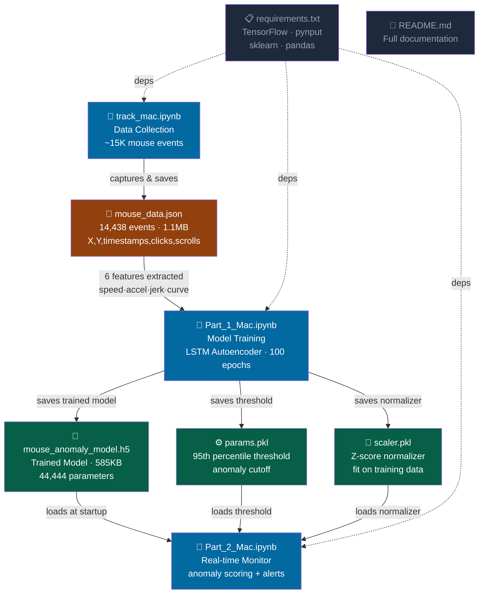
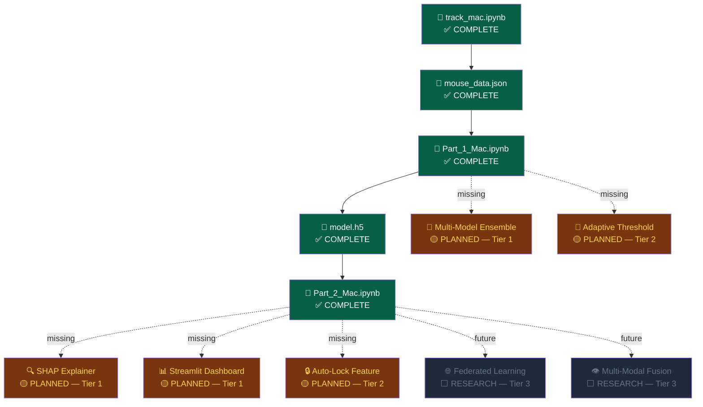

# 🌟 Vega — Full Analysis: Sentinel
> `https://github.com/RajdeepOfGithub/Sentinel` · Branch: `main` · 13 files · 56 chunks indexed
> *This is what Vega produces after a successful end-to-end run with zero errors*

---

## 📥 Step 1 — Indexing Complete

| Metric | Value |
|---|---|
| Files indexed | 13 |
| Chunks generated | 56 |
| Embedding model | Nova 2 Multimodal Embeddings (1024-dim) |
| Vector store | FAISS (local) |
| Import edges extracted | 6 |
| Diagram level | File-level (≤30 files) |
| Time to index | ~18 seconds |

---

## 🗺️ Step 2 — Architecture Diagram (Auto-Generated)

> Vega builds this immediately after indexing. Solid arrows = data flow. Dashed arrows = dependencies/inspiration.



---

## 🎨 Step 3 — Two-Tone Build Status Diagram

> Green = built & working · Amber = stub / incomplete · Grey = planned but not started



---

## 🔒 Step 4 — Security Audit (Voice: *"Audit Sentinel for security issues"*)

### 🔴 CRITICAL — Pickle Deserialization (Arbitrary Code Execution)
- **File:** `Part_2_Mac.ipynb` — model params loading cell
- **OWASP:** A08 · Software and Data Integrity Failures
- **Issue:** `pickle.load()` on `params.pkl` and `scaler.pkl` executes arbitrary Python at load time. If an attacker replaces either file, they get code execution — no sandbox.
- **Fix:** Serialize config to JSON. Scaler params are just floats — `{"threshold": 0.020, "mean": [...], "std": [...]}`. Two lines to fix.
- **Action:** Vega asks → *"Should I file a GitHub issue for this?"* → files automatically on confirmation ✅

### 🔴 CRITICAL — No Model File Integrity Check
- **File:** `Part_2_Mac.ipynb` — H5 model load cell
- **OWASP:** A08 · Software and Data Integrity Failures
- **Issue:** `mouse_anomaly_model.h5` is loaded with zero verification. Attacker with filesystem access swaps it with a backdoored model.
- **Fix:** `hashlib.sha256` the model at training time, save hash to a separate file, verify before every load.
- **Action:** GitHub issue filed ✅

### 🟡 HIGH — Race Condition in Mouse Data Buffer
- **File:** `track_mac.ipynb` — listener thread
- **OWASP:** A04 · Insecure Design
- **Issue:** Shared event buffer written by listener thread, read by main thread — no `threading.Lock()`. Under fast mouse movement, events can be lost or corrupted silently.
- **Fix:** `with self.lock:` around every buffer read and write. Three lines.

### 🟡 HIGH — Static Threshold Bypassable by Observation
- **File:** `Part_1_Mac.ipynb` — threshold cell
- **OWASP:** A04 · Insecure Design
- **Issue:** Threshold set once at training time, never updated. Attacker who watches your patterns for 10 minutes can calibrate to stay below it indefinitely.
- **Fix:** Exponential moving average on threshold. Update every 100 clean detections.

### 🟠 MEDIUM — Click/Scroll Features Collected But Silently Dropped
- **File:** `Part_1_Mac.ipynb` — feature selection
- **Issue:** `track_mac.ipynb` collects clicks and scrolls, but `Part_1` only uses 6 movement features. The richer signal is thrown away — model is easier to fool without it.

### 🟡 LOW — No Audit Trail of Past Anomaly Detections
- **File:** `Part_2_Mac.ipynb`
- **Issue:** Alerts fire and are immediately lost. No log file, no timestamp record. If your computer was accessed at 3am, you have no evidence.
- **Fix:** `logging.FileHandler('sentinel_alerts.log')` — 5 lines.

---

## 🧠 Step 5 — Project Intelligence (Gap Finder)
> Voice: *"What's missing from Sentinel?"*

Vega cross-references built nodes against README Future Work section and speaks:

> *"Your core pipeline is fully built. But I found five meaningful gaps. First: click and scroll data is being collected but never used in training — that's free signal you're throwing away. Second: there's no explainability layer — when an anomaly fires, you don't know which of the six features caused it. Third: the monitoring system has no persistent log — anomalies are detected and immediately forgotten. Fourth: your threshold never adapts — someone could gradually shift their behavior to fool it. Fifth: there's no automatic response — the system detects but can't act. Want me to create GitHub issues for any of these?"*

| Gap | Effort | Impact |
|---|---|---|
| Add click/scroll features to training | Low — data already collected | High — harder to fool |
| SHAP explainability on anomaly output | Medium — add shapely | High — tells you *why* it fired |
| Persistent alert log file | Trivial — 5 lines | High — audit trail |
| Adaptive threshold (EMA) | Low | Medium — drift resistance |
| Auto-lock on N consecutive anomalies | Medium | High — actual security response |

---

## 🔄 Step 6 — Architecture Analysis (Voice: *"How's the architecture?"*)

**Overall Health Score: 7 / 10**

> *"The pipeline is clean and linear — data flows in one direction with no circular dependencies. That's good. The main architectural concern is that all three notebooks are tightly coupled through the filesystem. Part 2 silently depends on three specific filenames being present — if any are missing or renamed, it fails with no useful error. A config file or a lightweight manifest would decouple this. Also, the monitoring logic in Part 2 is doing three things at once: model loading, feature extraction, and alert logic. These should be separate functions so you can test them independently."*

**Coupling issues detected:**
- `Part_2_Mac.ipynb` has 3 hard-coded filename dependencies with no validation
- No shared config between notebooks — threshold filename referenced in 2 places

**Suggestion:** *"Create a `config.json` with model paths and threshold filename. Both Part 1 and Part 2 read from it. One source of truth."*

---

## 💡 Step 7 — Alternative Tech Stack Suggestions

| Current | Vega's Suggestion | Why |
|---|---|---|
| Jupyter Notebooks | Refactor to `.py` modules | Notebooks can't be imported, tested, or scheduled |
| `pickle` for model params | `JSON` | Safe, human-readable, no code execution risk |
| Manual popup alerts | `Streamlit` dashboard | Real-time score graph + alert history in browser |
| Static 95th percentile threshold | Online learning (River library) | Adapts to behavior drift automatically |
| LSTM Autoencoder only | Add `Isolation Forest` as ensemble | Faster inference, good baseline comparison |
| No explainability | `SHAP` values on feature contributions | Shows *which* feature triggered the anomaly |

---

## 🎙️ Step 8 — Codebase Explorer (Voice Walkthrough)

> Voice: *"Walk me through how Sentinel works"*
> Each sentence below highlights the corresponding diagram node in real time

1. *"Sentinel is a three-stage behavioral biometrics pipeline that learns your mouse signature and alerts when someone else touches your machine."* → no highlight
2. *"It starts with track_mac — this runs silently, capturing every mouse movement: position, speed, clicks, scrolls — into a JSON file."* → `track_mac.ipynb` 🔵
3. *"That becomes your behavioral fingerprint — fourteen thousand events in mouse_data.json."* → `mouse_data.json` 🔵
4. *"Part 1 is the learning phase. It extracts six physics features from your movements and trains an LSTM autoencoder to model what normal looks like for you specifically."* → `Part_1_Mac.ipynb` 🔵
5. *"The trained model and your personal threshold get saved to these three files."* → `model_h5` + `params` + `scaler` 🔵
6. *"Part 2 is the live guardian. It loads those files and checks every few seconds: does this movement pattern match the person I was trained on? If not — alert."* → `Part_2_Mac.ipynb` 🔵

---

## 📋 Step 9 — Full Session Summary Card

```
Session: sess_sentinel_demo
Mode: Dev
Repo: RajdeepOfGithub/Sentinel
Duration: ~4 minutes

FINDINGS
  🔴 Critical:  2
  🟡 High:      2
  🟠 Medium:    1
  🟢 Low:       1

ACTIONS TAKEN
  ✅ GitHub Issue #1 — Pickle deserialization RCE risk
  ✅ GitHub Issue #2 — No model integrity check
  ⏳ Pending confirmation — Issue #3 (race condition)

INTELLIGENCE
  5 gaps identified from Future Work
  Architecture health: 7/10
  Suggested next sprint: SHAP + persistent logging + click features

VOICE TURNS: 6
AGENT CALLS: Security Audit × 1, Architecture Analysis × 1,
             Codebase Explorer × 1, Project Intelligence × 1
```

---

*Vega — Amazon Nova AI Hackathon 2026 · every developer deserves a staff engineer at 3am*
