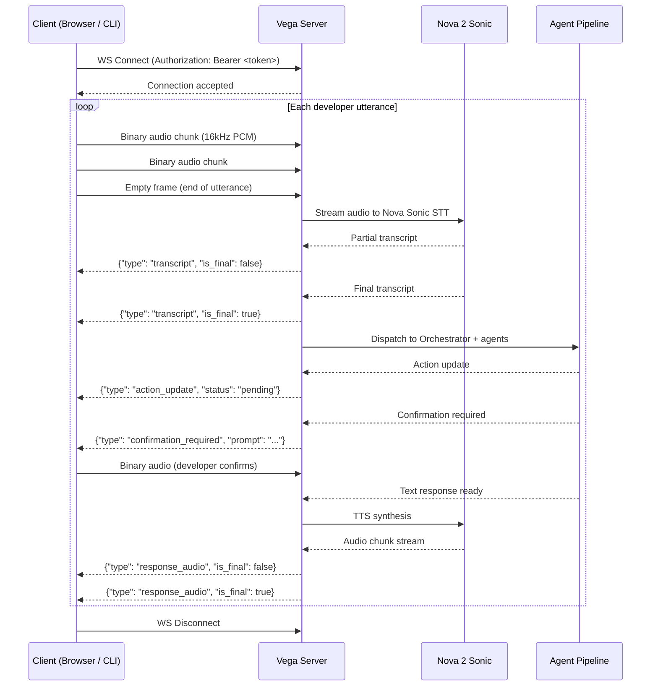

# 🔌 Vega — API Reference

> See also: [[ARCHITECTURE]] | [[AGENTS]] | [[ENV]] | [[Roadmap]]

---

Vega's backend is a FastAPI server. All voice streaming uses WebSocket for real-time bidirectional audio — using HTTP for voice would introduce unacceptable latency. All other communication (session management, repo indexing, action confirmation) uses REST.

**Base URL (development):** `http://localhost:8000`
**WebSocket Base (development):** `ws://localhost:8000`

---

## 1. WebSocket Endpoints

### `WS /ws/voice`

**Purpose:** Real-time bidirectional voice streaming. The client streams raw audio chunks to the server; the server streams back transcripts, action status updates, and TTS audio chunks as JSON frames and binary payloads.

**Authentication:** Bearer token passed in the `Authorization` connection header at handshake time.

**Client → Server (binary):**
Raw 16kHz PCM mono audio chunks. Send continuously while the user is speaking. Signal end-of-utterance by sending an empty binary frame.

**Server → Client (JSON frames):**

| `type` field | Payload | When sent |
|---|---|---|
| `"transcript"` | `{"type": "transcript", "text": "...", "is_final": bool}` | As speech is being transcribed (partial + final) |
| `"action_update"` | `{"type": "action_update", "action_id": "...", "description": "...", "status": "pending\|success\|failed"}` | Each time an autonomous action changes state |
| `"response_audio"` | `{"type": "response_audio", "chunk": "<base64>", "is_final": bool, "highlighted_nodes": ["file/path.py"] \| []}` | As TTS audio is synthesized and streamed back |
| `"confirmation_required"` | `{"type": "confirmation_required", "action_id": "...", "prompt": "..."}` | When a destructive action requires voice confirmation |
| `"error"` | `{"type": "error", "code": "...", "message": "..."}` | On any processing failure |

> `highlighted_nodes` is present on every `response_audio` frame from the Codebase Explorer Agent. It contains an array of file or folder paths matching node IDs in the current Mermaid diagram. An empty array means no highlight change for that sentence. The frontend advances to the next highlight state only when `is_final: true` is received — never before.

**WebSocket Lifecycle:**



**Error Codes:**

| Code | Meaning |
|---|---|
| `AUTH_FAILED` | Invalid or expired bearer token |
| `SESSION_NOT_FOUND` | No active session for this connection |
| `NOVA_SONIC_UNAVAILABLE` | Nova Sonic WebSocket connection dropped |
| `AGENT_TIMEOUT` | Agent pipeline exceeded 10s processing limit |

---

## 2. REST Endpoints

---

### `POST /repo/index`

**Purpose:** Trigger ingestion of a GitHub repository — clone, chunk, embed via Nova Multimodal Embeddings, and store in the FAISS index.

**Request Body:**
```json
{
  "repo_url": "https://github.com/org/repo",
  "branch": "main",
  "github_token": "ghp_..."
}
```

**Response `200 OK`:**
```json
{
  "job_id": "idx_a1b2c3d4",
  "status": "indexing",
  "file_count": 142,
  "estimated_duration_seconds": 45
}
```

**Error Codes:**

| Status | Meaning |
|---|---|
| `401` | Invalid or insufficient GitHub token permissions |
| `404` | Repository not found or token lacks access |
| `422` | Invalid repo URL format or unsupported host |

---

### `GET /repo/status/{job_id}`

**Purpose:** Poll the progress of an ongoing indexing job.

**Response `200 OK`:**
```json
{
  "job_id": "idx_a1b2c3d4",
  "status": "indexing",
  "progress": 67,
  "chunks_indexed": 891,
  "total_chunks": 1330,
  "error": null
}
```

`status` values: `"indexing"` | `"complete"` | `"failed"`

**Error Codes:**

| Status | Meaning |
|---|---|
| `404` | `job_id` does not exist |

---

### `GET /repo/diagram/{job_id}`

**Purpose:** Retrieve the generated Mermaid diagram for a completed indexing job. Called automatically by the frontend after `GET /repo/status` returns `"status": "complete"`.

**Response `200 OK`:**
```json
{
  "job_id": "idx_a1b2c3d4",
  "diagram_level": "file | folder",
  "file_count": 67,
  "mermaid": "flowchart TD\n    A[api/] --> B[gateway.py]\n    ...",
  "node_ids": ["api/gateway.py", "middleware/jwt.py"],
  "generated_at": "2026-02-24T10:00:00Z"
}
```

**Error Codes:**

| Status | Meaning |
|---|---|
| `404` | `job_id` not found or indexing not yet complete |
| `422` | Repo exceeded 100 file limit — diagram not generated |
| `500` | Mermaid generation failed and fallback also failed |

---

### `POST /session/start`

**Purpose:** Initialize a new Vega session in Dev Mode or Ops Mode. A session must exist before opening a voice WebSocket connection.

**Request Body:**
```json
{
  "mode": "dev",
  "repo_id": "idx_a1b2c3d4"
}
```

`mode` values: `"dev"` | `"ops"`

**Response `200 OK`:**
```json
{
  "session_id": "sess_9f8e7d6c",
  "mode": "dev",
  "repo_id": "idx_a1b2c3d4",
  "created_at": "2026-02-23T15:30:00Z"
}
```

**Error Codes:**

| Status | Meaning |
|---|---|
| `404` | `repo_id` index not found or not yet complete |
| `422` | Invalid `mode` value |

---

### `GET /session/{session_id}/history`

**Purpose:** Retrieve the full conversation history for a session — all turns, transcripts, agent findings, and action records.

**Response `200 OK`:**
```json
{
  "session_id": "sess_9f8e7d6c",
  "mode": "dev",
  "created_at": "2026-02-23T15:30:00Z",
  "messages": [
    {
      "id": "msg_001",
      "role": "user",
      "content": "Review my auth module for security issues",
      "timestamp": "2026-02-23T15:30:45Z"
    },
    {
      "id": "msg_002",
      "role": "vega",
      "content": "Found 2 critical issues in your authentication handler...",
      "findings": [...],
      "timestamp": "2026-02-23T15:30:47Z"
    }
  ]
}
```

**Error Codes:**

| Status | Meaning |
|---|---|
| `404` | Session not found |

---

### `GET /session/{session_id}/actions`

**Purpose:** Retrieve all autonomous actions taken or proposed during a session, including their current status.

**Response `200 OK`:**
```json
{
  "session_id": "sess_9f8e7d6c",
  "actions": [
    {
      "action_id": "act_aa11bb22",
      "timestamp": "2026-02-23T15:31:02Z",
      "type": "github_issue",
      "description": "File GitHub issue: SQL injection vulnerability in auth/login.py line 47",
      "status": "success",
      "url": "https://github.com/org/repo/issues/123",
      "confirmed_at": "2026-02-23T15:31:00Z"
    }
  ]
}
```

`status` values: `"pending"` | `"awaiting_confirmation"` | `"success"` | `"failed"` | `"cancelled"`

---

### `POST /action/confirm`

**Purpose:** Safety gate — confirm or reject a pending destructive action. This endpoint is called programmatically when the developer's voice confirmation is detected, but can also be called directly for testing.

**Request Body:**
```json
{
  "session_id": "sess_9f8e7d6c",
  "action_id": "act_aa11bb22",
  "confirmed": true
}
```

**Response `200 OK`:**
```json
{
  "action_id": "act_aa11bb22",
  "status": "executing"
}
```

If `confirmed: false`:
```json
{
  "action_id": "act_aa11bb22",
  "status": "cancelled"
}
```

**Error Codes:**

| Status | Meaning |
|---|---|
| `404` | `action_id` not found in session |
| `409` | Action already executed or already cancelled — cannot re-confirm |
| `422` | `action_id` does not belong to the given `session_id` |

---

### `GET /health`

**Purpose:** Health check endpoint. Returns server status and the connection state of all external dependencies (Nova, GitHub, AWS). Use this to verify environment setup before a demo.

**Response `200 OK`:**
```json
{
  "status": "ok",
  "nova_sonic": "connected",
  "bedrock": "connected",
  "github": "connected",
  "aws": "connected",
  "faiss_index": "loaded",
  "uptime_seconds": 3742
}
```

Connection state values: `"connected"` | `"disconnected"` | `"degraded"`

---

## 3. Data Models

### Message Object

| Field | Type | Description |
|---|---|---|
| `id` | string | Unique message ID (e.g., `msg_001`) |
| `role` | string | `"user"` or `"vega"` |
| `content` | string | The spoken/text content of the message |
| `findings` | array of Finding | Dev Mode findings attached to this turn (optional) |
| `incident` | Incident object | Ops Mode incident object attached to this turn (optional) |
| `timestamp` | ISO 8601 string | UTC timestamp of the message |

---

### Action Log Object

| Field | Type | Description |
|---|---|---|
| `action_id` | string | Unique action ID (e.g., `act_aa11bb22`) |
| `timestamp` | ISO 8601 string | When the action was proposed |
| `type` | string | `"github_issue"` \| `"github_pr"` \| `"github_review"` \| `"aws_read"` \| `"aws_write"` |
| `description` | string | Human-readable description of what the action does |
| `status` | string | `"pending"` \| `"awaiting_confirmation"` \| `"executing"` \| `"success"` \| `"failed"` \| `"cancelled"` |
| `url` | string (optional) | Link to the resulting GitHub issue, PR, or AWS resource |
| `confirmed_at` | ISO 8601 string (optional) | When voice confirmation was received |
| `error` | string (optional) | Error message if `status` is `"failed"` |

---

### Session Object

| Field | Type | Description |
|---|---|---|
| `session_id` | string | Unique session ID (e.g., `sess_9f8e7d6c`) |
| `mode` | string | `"dev"` or `"ops"` |
| `repo_id` | string | Reference to the indexed repo (from indexing job) |
| `created_at` | ISO 8601 string | Session creation time |
| `last_active_at` | ISO 8601 string | Timestamp of last message or action |
| `message_count` | integer | Total number of conversation turns |
| `action_count` | integer | Total actions taken in this session |

---

### Incident Object

| Field | Type | Description |
|---|---|---|
| `incident_id` | string | Unique incident ID |
| `service` | string | Affected AWS service identifier (e.g., `"lambda:auth-service"`) |
| `time_window_start` | ISO 8601 string | Start of the investigation time window |
| `time_window_end` | ISO 8601 string | End of the investigation time window |
| `severity` | string | `"P1"` (production down) \| `"P2"` (degraded) \| `"P3"` (intermittent) |
| `description` | string | Developer's original voice description of the incident |
| `status` | string | `"triaging"` \| `"investigating"` \| `"root_cause_found"` \| `"fix_ready"` \| `"resolved"` |

---

### Finding Object (Dev Mode)

| Field | Type | Description |
|---|---|---|
| `finding_id` | string | Unique finding ID |
| `category` | string | `"security"` \| `"code_quality"` \| `"architecture"` \| `"pr_review"` |
| `severity` | string | `"CRITICAL"` \| `"HIGH"` \| `"MEDIUM"` \| `"LOW"` |
| `file` | string | File path where the issue was found |
| `line` | integer | Line number (or start line for a range) |
| `description` | string | Technical description of the issue |
| `remediation` | string | Suggested fix or next action |
| `owasp_category` | string (optional) | OWASP Top 10 category if applicable |
| `cve_reference` | string (optional) | CVE ID if a known vulnerability |
