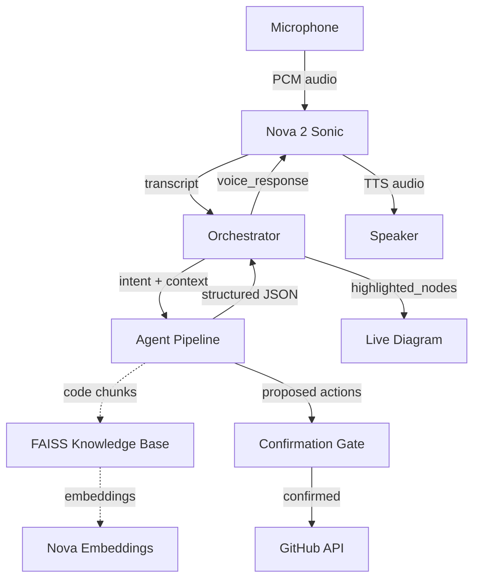

# Vega — Voice-Powered AI Staff Engineer

> Talk to your codebase. Ship faster.

**Amazon Nova AI Hackathon 2026** | Built entirely on Amazon Nova models

Vega is a voice-activated multi-agent AI system that acts as an on-call staff engineer. Speak a request — Vega classifies intent, dispatches specialized agents, streams analysis back as natural speech, and highlights the relevant architecture diagram nodes in real time.

## How It Works

```
Voice In (Nova Sonic) → Intent Classification (Nova Lite)
    → Agent Pipeline (9 specialized agents)
        → Voice Out (Nova Sonic) + Live Diagram Highlighting
            → Proposed Actions → Voice Confirmation Gate → Execute
```

1. **Speak** — developer describes what they need via microphone
2. **Classify** — orchestrator identifies intent and routes to the right agent
3. **Analyze** — specialized agent processes code chunks from the knowledge base
4. **Respond** — findings streamed as speech with synchronized diagram highlighting
5. **Act** — destructive actions (GitHub issues, PRs) require explicit voice confirmation

## Two Modes

| Mode | Agents | Golden Path |
|------|--------|-------------|
| **Dev Mode** | Code Review, Security Audit, Architecture Analysis, PR Review, Codebase Explorer | Security audit via voice → findings spoken → GitHub issue filed (with confirmation) |
| **Ops Mode** | Incident Triage, Log Parser, Root Cause Analysis, Fix Draft | Lambda failure → CloudWatch logs parsed → root cause spoken → draft PR (with confirmation) |

## Amazon Nova Models

| Model | Role | How Used |
|-------|------|----------|
| **Nova 2 Sonic** | Voice I/O | Bidirectional WebSocket — STT + TTS at <1.5s latency |
| **Nova 2 Lite** | Reasoning | Powers all 9 specialized agents via Bedrock `converse` API |
| **Nova Multimodal Embeddings** | Knowledge Base | `amazon.nova-embed-v1:0` — embeds code chunks into FAISS |
| **Nova Act** | Browser Automation | Secondary/fallback for AWS Console operations |

## Architecture



## Project Structure

```
Vega/
├── agents/          Orchestrator + 9 specialized agents (dev_mode/, ops_mode/)
├── api/             FastAPI server — REST + WebSocket endpoints
├── voice/           Nova Sonic bidirectional streaming (STT/TTS)
├── ingestion/       Repo cloning, code chunking, FAISS indexing
├── diagram/         Two-tone diagram generator (built/stub/planned coloring)
├── actions/         GitHub + AWS action executors (behind confirmation gate)
├── prompts/         System prompts for all agents
├── frontend/        React/Next.js UI with live diagram + voice controls
├── data/            FAISS indices + cloned repos (gitignored)
└── docs/            Architecture docs, agent specs, API reference
```

## Quick Start

```bash
# 1. Clone and install
git clone https://github.com/your-org/vega.git && cd vega
pip install -r requirements.txt

# 2. Configure environment
cp .env.example .env
# Fill in: AWS_ACCESS_KEY_ID, AWS_SECRET_ACCESS_KEY, AWS_REGION, GITHUB_TOKEN

# 3. Start the backend
uvicorn api.server:app --host 0.0.0.0 --port 8000

# 4. Start the frontend
cd frontend && npm install && npm run dev

# 5. Verify
curl http://localhost:8000/health
```

See [`docs/ENV.md`](docs/ENV.md) for the full setup checklist and required IAM policy.

## Safety Gate

All destructive actions — filing GitHub issues, creating PRs, writing AWS resources — require explicit voice confirmation before execution. This is enforced at the API layer (`POST /action/confirm`) and cannot be bypassed.

## Built For

**Amazon Nova AI Hackathon 2026** — demonstrating that four Nova model families (Sonic, Lite, Embeddings, Act) can combine into a coherent, voice-first developer tool that ships real value.

## License

[MIT](LICENSE)
