# 🌟 Vega — Project Roadmap

> Voice-Powered AI Staff Engineer for Dev & Ops Amazon Nova AI Hackathon 2026 | Deadline: March 16, 2026

---

## 📌 Quick Summary

Vega is a voice-powered multi-agent AI system that acts as a staff engineer for developers. It has two modes — **Dev Mode** (code review, architecture analysis, PR feedback via voice) and **Ops Mode** (incident detection, log investigation, root cause analysis via voice). Everything is powered by Amazon Nova — Sonic for voice, Multimodal Embeddings for codebase indexing, Nova Lite for reasoning agents, and Nova Act for autonomous actions.

---

## 🗺️ High-Level Project Phases

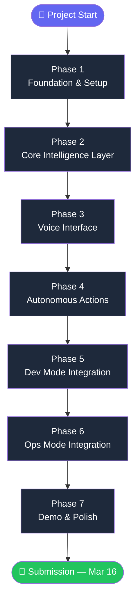

---

## 📅 Timeline Overview

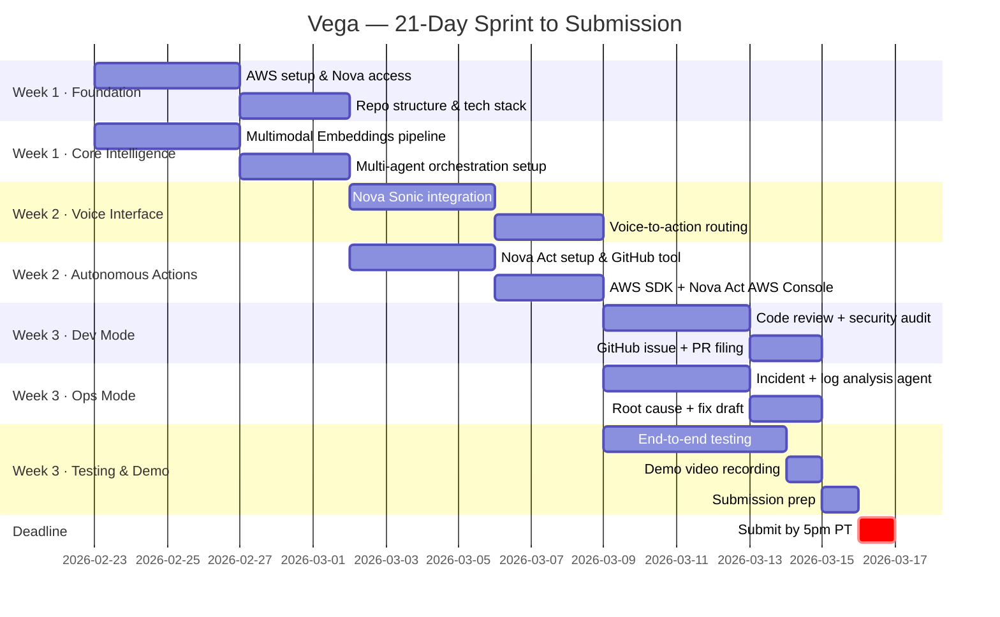

---

## 🏗️ System Architecture

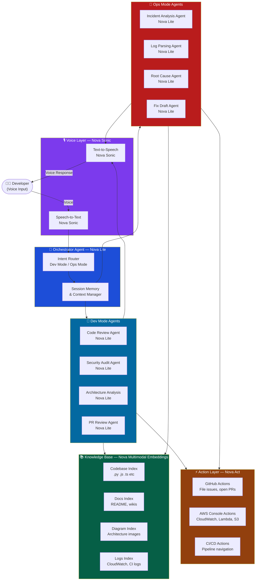

---

## 🔵 Dev Mode — Detailed Flow

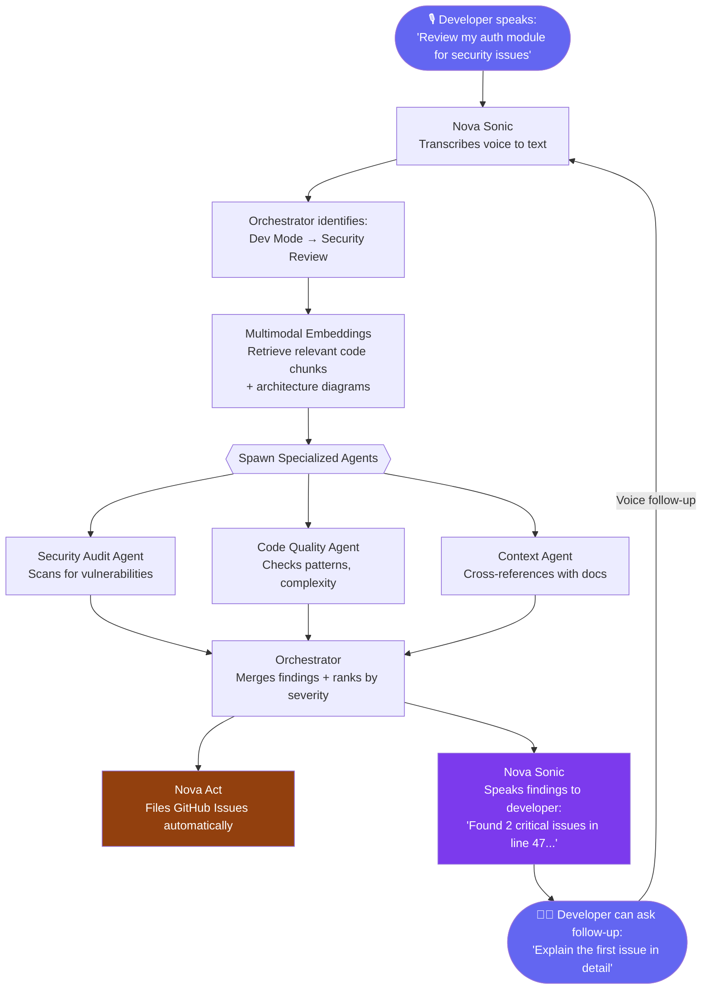

---

## 🔴 Ops Mode — Detailed Flow

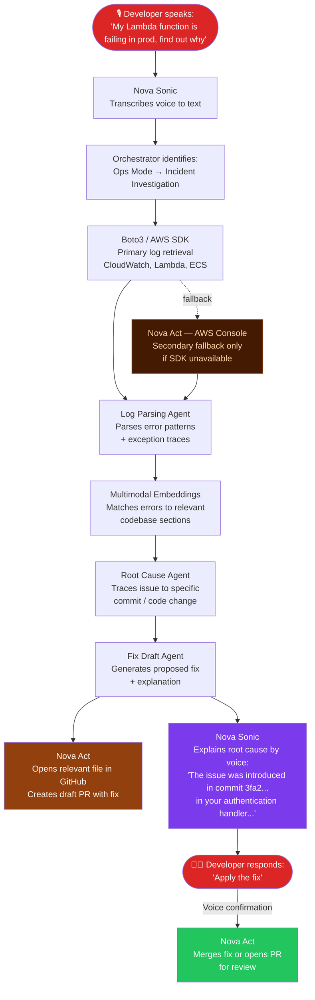

---

## 🧱 Tech Stack

```mermaid
flowchart LR
    subgraph AWS_Nova ["Amazon Nova — Core"]
        Sonic["Nova 2 Sonic\nVoice I/O"]
        Lite["Nova 2 Lite\nReasoning Agents"]
        Embed["Nova Multimodal\nEmbeddings"]
        Act["Nova Act\nUI Automation"]
    end

    subgraph Framework ["Orchestration Framework"]
        Strands["AWS Strands Agents\nor LangGraph"]
        MCP["MCP Tools\nGitHub, AWS, CI/CD"]
    end

    subgraph Infra ["Infrastructure"]
        S3["AWS S3\nCodebase + Log Storage"]
        Lambda["AWS Lambda\nAgent Execution"]
        Bedrock["Amazon Bedrock\nModel Access"]
    end

    subgraph Frontend ["Interface"]
        Web["Web UI\nReact or Next.js"]
        CLI["CLI Interface\nTerminal option"]
    end

    AWS_Nova --> Framework
    Framework --> Infra
    Infra --> Frontend
```

---

## 📦 Phase Breakdown — Detailed Tasks

### Phase 1 — Foundation & Setup

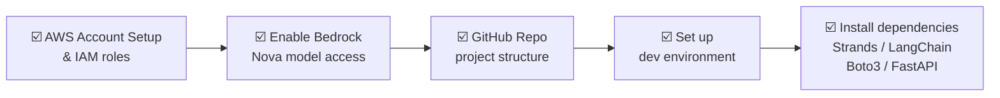

### Phase 2 — Core Intelligence Layer

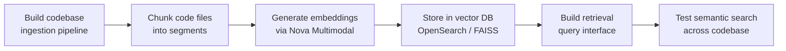

### Phase 3 — Voice Interface

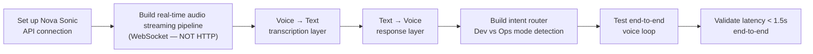

### Phase 4 — Autonomous Actions

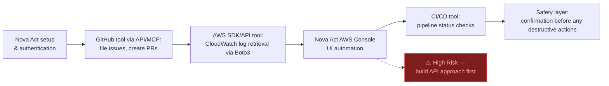

---

## 🗂️ Recommended Folder Structure

```
vega/
├── README.md
├── requirements.txt
│
├── ingestion/
│   ├── repo_loader.py          # GitHub repo cloning + file parsing
│   ├── embeddings.py           # Nova Multimodal Embeddings pipeline
│   └── vector_store.py         # Vector DB interface
│
├── agents/
│   ├── orchestrator.py         # Main routing agent
│   ├── dev_mode/
│   │   ├── code_review.py      # Code review agent
│   │   ├── security_audit.py   # Security analysis agent
│   │   └── pr_review.py        # PR review agent
│   └── ops_mode/
│       ├── incident.py         # Incident analysis agent
│       ├── log_parser.py       # Log parsing agent
│       ├── root_cause.py       # Root cause analysis agent
│       └── fix_draft.py        # Fix generation agent
│
├── voice/
│   ├── sonic_client.py         # Nova Sonic STT/TTS
│   └── audio_stream.py         # Real-time audio pipeline
│
├── actions/
│   ├── github_actions.py       # Nova Act — GitHub
│   └── aws_actions.py          # Nova Act — AWS Console
│
├── api/
│   └── server.py               # FastAPI backend
│
├── prompts/                    # Version-controlled system prompts — treat as core IP
│   ├── orchestrator.txt        # System prompt for main routing agent
│   ├── dev_mode/
│   │   ├── code_review.txt          # Code review agent system prompt
│   │   ├── security_audit.txt       # Security audit agent system prompt
│   │   ├── architecture_analysis.txt # Architecture analysis agent system prompt
│   │   └── pr_review.txt            # PR review agent system prompt
│   └── ops_mode/
│       ├── incident.txt        # Incident analysis agent system prompt
│       ├── log_parser.txt      # Log parsing agent system prompt
│       ├── root_cause.txt      # Root cause agent system prompt
│       └── fix_draft.txt       # Fix generation agent system prompt
│
└── frontend/
    └── app/                    # React UI
```

---

## ⚠️ Risk Register

| Risk | Severity | Mitigation |
|---|---|---|
| Nova Act AWS Console navigation fails | 🔴 High | Use Boto3/SDK API calls first, Nova Act UI as bonus |
| Voice latency > 2 seconds | 🔴 High | WebSocket streaming from Day 1, test latency continuously |
| 21-day timeline too tight for all 8 agents | 🟡 Medium | Build one golden path per mode first, expand if time allows |
| Diagram indexing too complex | 🟡 Medium | Defer diagram demos, prioritize code + log indexing |
| Voice interface unstable near deadline | 🟡 Medium | Keep agent backend interface-agnostic, CLI fallback ready |
| Scope creep from multi-service Ops Mode | 🟡 Medium | Lambda + one more service (ECS) is sufficient for demo |

---

## ✅ Submission Checklist

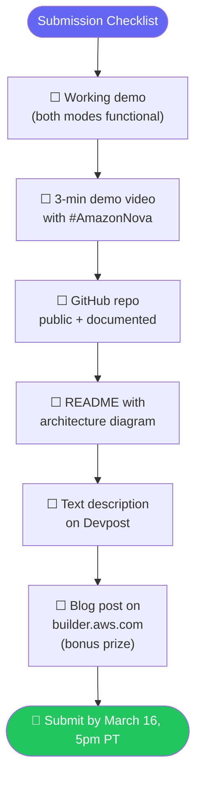

---

## 🏆 Judging Criteria Alignment

|Criteria|Weight|How Vega Addresses It|
|---|---|---|
|Technical Implementation|**60%**|Multi-agent pipeline, all 4 Nova capabilities used meaningfully, real-time voice streaming, autonomous actions|
|Community / Business Impact|**20%**|Reduces incident resolution time, democratizes senior engineer access for small teams|
|Creativity & Innovation|**20%**|Voice + autonomous action combo is novel, no existing tool does this end-to-end|

---

## 💡 Notes & Ideas

- [ ] Demo video structure: 0:00–1:30 Dev Mode demo → 1:30–3:00 Ops Mode live incident demo
- [ ] Blog post angle: "How Vega gives solo developers and small teams access to a staff engineer they could never afford to hire"
- [ ] Ops Mode: extend to support multi-service AWS investigation — Lambda, CloudWatch, ECS/EKS, API Gateway, RDS, S3, EC2, CodePipeline
- [ ] Kubernetes log analysis support in Ops Mode (EKS)
- [ ] Slack integration via Nova Act — voice alerts through Slack bot
- [ ] Safety layer is NON-NEGOTIABLE: Vega must always ask "Should I apply this fix to production?" before any destructive action. This demonstrates AI alignment — a major judging signal.
- [ ] Diagram indexing: keep in architecture for judges, but descope from demo if time is short — show code + docs indexing first
- [ ] Contingency plan: if voice interface is unstable by March 10, the agent backend should be interface-agnostic so a CLI fallback can be wired in within 1-2 hours without a rebuild
- [ ] Scope for demo: one "golden path" per mode is enough to win — Dev Mode: security audit via voice → GitHub issue filed / Ops Mode: Lambda/ECS failure → CloudWatch logs pulled → root cause spoken → draft PR created

---

_Built for the Amazon Nova AI Hackathon 2026 | Deadline: March 16, 2026 at 5pm PT_