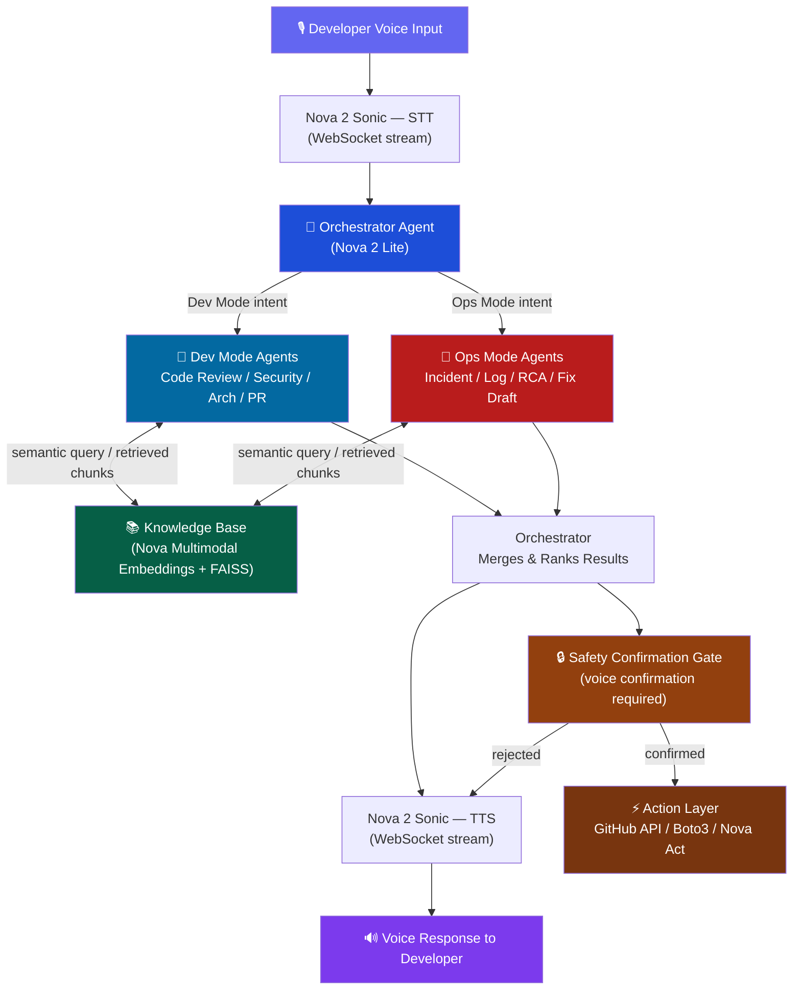
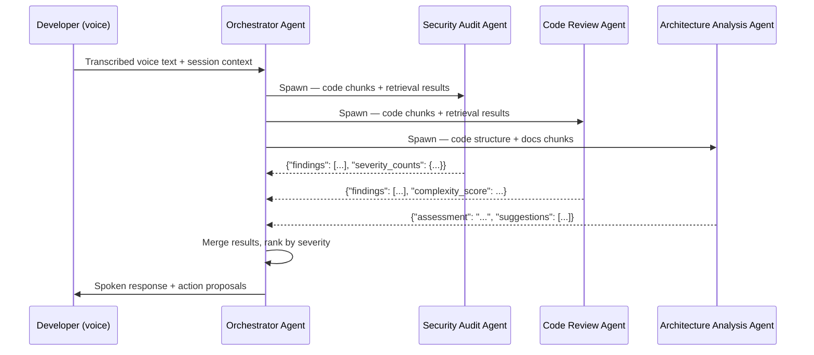
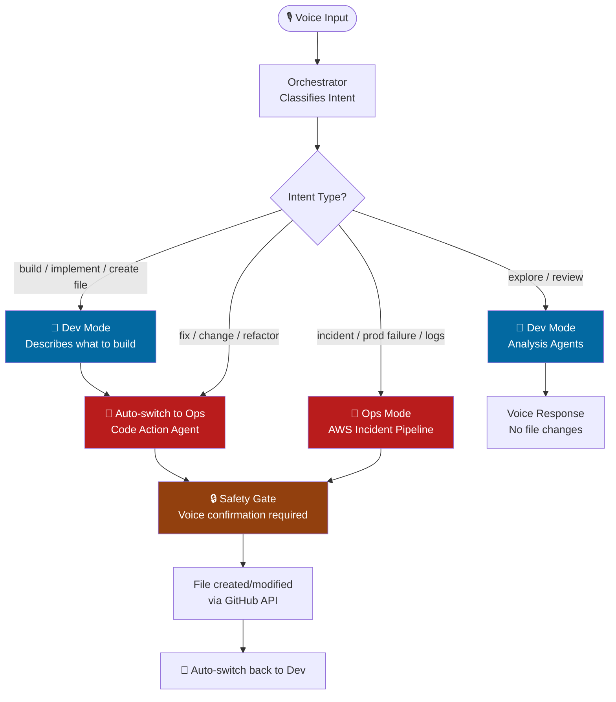

# 🏗️ Vega — Technical Architecture

> See also: [[AGENTS]] | [[API]] | [[Roadmap]]

---

## 1. Overview

Vega is a multi-agent AI system built entirely on Amazon Nova, designed to act as a voice-activated staff engineer for developers. At its core, Vega accepts real-time voice input via Nova 2 Sonic over a WebSocket stream, transcribes speech to text, and routes the intent through an Orchestrator Agent (Nova 2 Lite) that classifies the request into either Dev Mode or Ops Mode. Specialized sub-agents in each mode query a knowledge base built on Nova Multimodal Embeddings (indexed from the user's codebase, documentation, and logs stored in FAISS or OpenSearch) and produce structured findings. Those findings are spoken back to the developer through Nova Sonic TTS and, where required, acted upon autonomously via the GitHub API, Boto3 SDK, or Nova Act browser automation — always with an explicit safety confirmation gate before any destructive operation executes.

---

## 2. Core Design Principles

> [!TIP] Design Principles
> These four principles are non-negotiable architectural constraints. Every implementation decision should be evaluated against them.
>
> - **Voice-first, interface-agnostic** — the agent pipeline must never depend on a voice interface being present. A CLI input layer must always be wirable in within a few hours without touching the agent or action code.
> - **API-first actions** — Boto3/SDK calls are always the primary action mechanism. Nova Act browser automation is a secondary enhancement, not a dependency. If Nova Act breaks, Vega still functions.
> - **One golden path per mode** — for demo and deadline purposes, depth beats breadth. Dev Mode: security audit via voice → GitHub issue filed. Ops Mode: Lambda/ECS failure → CloudWatch logs → root cause spoken → draft PR created.
> - **Safety by default** — no destructive action (PR merge, issue creation, AWS write) executes without explicit voice confirmation from the developer. This is not optional and must not be feature-flagged off.

---

## 3. Component Breakdown

| Component | Technology | Purpose | Input | Output |
|---|---|---|---|---|
| Voice Input Layer | Nova 2 Sonic, WebSocket (16kHz PCM) | Real-time speech-to-text streaming | Raw audio binary chunks | Transcribed text string |
| Voice Output Layer | Nova 2 Sonic TTS | Convert agent response text to speech | Plain text response | Audio stream chunks |
| Orchestrator Agent | Nova 2 Lite via Amazon Bedrock | Intent classification and session routing | Transcribed voice text + session context | Structured task object dispatched to mode agents |
| Session Memory | In-memory context manager (Python dict / Redis) | Maintain conversation context across turns | Prior messages, active session metadata | Context object injected into every agent call |
| Knowledge Base | Nova Multimodal Embeddings + FAISS (or OpenSearch) | Semantic retrieval across code, docs, diagrams, logs | Natural language query | Top-k relevant chunks with source metadata |
| Code Ingestion Pipeline | Boto3 + GitHub API | Clone repo, chunk files, embed, store | GitHub repo URL + auth token | Embedded vectors in FAISS index |
| Dev Mode Agents (×4) | Nova 2 Lite | Code review, security audit, architecture analysis, PR review | Code chunks + retrieval results | Structured findings JSON with severity rankings |
| Ops Mode Agents (×4) | Nova 2 Lite | Incident triage, log parsing, root cause analysis, fix drafting | Voice description + CloudWatch logs + code chunks | Incident object, root cause statement, proposed code fix |
| GitHub Action Layer | GitHub REST API + MCP GitHub tool | File issues, create draft PRs, post review comments | Structured action payload | GitHub resource URL + confirmation |
| AWS Log Retrieval Layer | Boto3 (primary), Nova Act (secondary) | Pull CloudWatch logs, Lambda execution logs, ECS task logs | Service name + time window | Raw log JSON, parsed into log chunks |
| Codebase Explorer Agent | Nova 2 Lite | Voice-guided repo exploration — generates sentence-by-sentence walkthroughs of file structure and code flows, paired with diagram node highlight targets | File tree + import graph + FAISS chunks | Ordered sentence array with `highlighted_nodes` per sentence |
| Repo Diagram Generator | Nova Lite + Mermaid.js | Generates a Mermaid architecture diagram from file tree and import graph immediately after indexing completes | Indexed file tree + import relationships | Valid Mermaid flowchart string with node IDs matching file/folder paths |

---

## 4. Data Flow Diagram



---

## 5. Nova Model Allocation

| Nova Model | Used For | Why This Model |
|---|---|---|
| Nova 2 Sonic | Voice input (STT) and voice output (TTS) | The only speech-to-speech model in the Nova family; supports real-time WebSocket streaming with sub-second latency |
| Nova 2 Lite | All 9 reasoning agents (Orchestrator + 4 Dev + 4 Ops) | Fast inference and low cost make it viable for chained multi-agent calls within a single user turn; sufficient reasoning depth for structured code and log analysis |
| Nova Multimodal Embeddings | Knowledge base indexing (code, docs, diagrams, logs) | Unified embedding space for text, images, and code means architecture diagrams and source files share the same vector index, enabling cross-modal retrieval |
| Nova Act | AWS Console UI automation (secondary action path) | Provides browser-level autonomous navigation when no public API exists for a specific AWS Console workflow; used only after Boto3/SDK approach is confirmed working |

---

## 6. Inter-Agent Communication

The Orchestrator is the sole entry point for all agent activity. It spawns sub-agents as needed, injects a shared context object into each, and collects structured JSON responses. Sub-agents do not communicate directly with each other — all information flows through the Orchestrator, which merges results and ranks them before dispatching to TTS or the action layer.

Each agent receives a `context` payload containing: the original transcribed voice text, the current session memory state, and the retrieved knowledge base chunks relevant to the query. Each agent must return a valid JSON response matching its defined output schema (see [[AGENTS]] for per-agent schemas).



---

## 7. Safety Architecture

> [!WARNING] Safety Layer — Non-Negotiable
> The safety confirmation gate is a hard architectural requirement. It cannot be bypassed, disabled, or feature-flagged off in any deployment.
>
> - **All destructive actions require explicit voice confirmation** — this includes: filing a GitHub issue, creating a PR, merging a PR, applying a code fix, and any AWS write operation.
> - **The confirmation prompt is always spoken aloud by Nova Sonic** — e.g., *"I'm going to create a draft PR with this fix. Should I proceed?"* — the developer must respond affirmatively.
> - **No action executes until an affirmative voice response is received** — ambiguous or negative responses cancel the pending action and log it as "cancelled".
> - **The `POST /action/confirm` API endpoint enforces this gate server-side** — the action layer will reject any execution request without a corresponding confirmed `action_id`.
> - **This is also a judging signal** — demonstrating AI alignment and human-in-the-loop control is explicitly rewarded by the Amazon Nova Hackathon judging criteria under Technical Implementation.

---

## 8. Repo Exploration & Diagram System

### How the Diagram is Generated

Immediately after the ingestion pipeline completes indexing, Vega runs a lightweight diagram generation pass:

1. Extract folder structure and file names from the indexed file tree
2. Extract import relationships by scanning import statements in indexed chunks
3. Feed file tree + import graph to Nova Lite with a prompt to generate a valid Mermaid flowchart
4. Validate the Mermaid output server-side before sending to the frontend
5. If validation fails, fall back to a plain text file tree view — never show a blank panel with no explanation
6. Tag every Mermaid node with its corresponding file or folder path so the frontend can highlight nodes by file path

Diagram render level:
- Repos under 30 files → file-level diagram
- Repos 30–100 files → folder-level diagram
- Repos over 100 files → rejected with a clear voice message

### Audio-as-Master-Clock Sync

The diagram highlight state is driven entirely by the audio stream. The highlight never advances based on a timer or assumption.

Rules:
- `is_final: false` on an audio chunk → diagram holds on current node
- `is_final: true` on an audio chunk → diagram advances to next node in sequence
- If `is_final` does not arrive within 3 seconds → diagram freezes on current node, does not advance, waits for audio to resume or reconnect
- Frontend validates every node ID before highlighting — if the ID does not exist in the current diagram, the highlight is silently skipped

### Client-Side Audio Buffer

A 300ms audio buffer is maintained client-side before playback begins. This absorbs network jitter without causing voice stuttering or diagram jumping. The next sentence's audio and highlight data are pre-queued while the current sentence is playing — zero gap between sentences.

### Edge Cases Handled

| Scenario | Handling |
|---|---|
| Circular imports in repo | Detected during ingestion, loop edge is broken, warning label added to that diagram edge |
| Mermaid rendering fails silently | Server-side validation catches this, fallback to text file tree |
| User interrupts mid-walkthrough | Audio queue and highlight queue both flushed immediately on new voice input |
| User asks something diagram cannot represent | Agent answers verbally, `highlighted_nodes` is empty array, diagram holds on last relevant node |
| Repo re-indexed mid-session | "Repo updated — refresh diagram?" banner shown, diagram not auto-swapped |
| Slow indexing on larger repos | Skeleton folder-structure diagram shown immediately from file tree, full diagram loads after indexing |

### Scope Constraint

Vega supports repositories of 100 files or fewer for this release. This eliminates monorepo complexity, 500+ file diagram rendering issues, and slow indexing at scale. If a user pastes a repo URL exceeding 100 files, Vega responds by voice: "This repository exceeds the current 100 file limit. Try pasting a link to a specific subdirectory instead."

---

## 9. Known Technical Risks

See full risk table: [[Roadmap#⚠️ Risk Register]]

> [!WARNING] Top 2 Critical Risks
>
> **🔴 Nova Act UI Fragility**
> Nova Act browser automation against the AWS Console is inherently brittle — AWS frequently updates its UI layout, which can break selectors. Mitigation: build all log retrieval and Lambda/ECS operations via Boto3 first. Nova Act AWS Console automation is a bonus demonstration layer only. If it breaks during demo, the system still fully functions via SDK.
>
> **🔴 Voice Latency**
> End-to-end latency (voice in → agent reasoning → voice response out) must stay under 1.5 seconds for the demo to feel responsive. This requires WebSocket streaming from day one — HTTP request-response will never meet this bar. Test latency continuously from Phase 3 forward; do not defer this to the final week.

---

## 10. Vega Modes System

Vega operates in three sub-modes within Dev Mode, plus a clear Dev→Ops auto-switch mechanism. Mode is determined by the Orchestrator based on intent classification, not manual user selection (though users can also voice-trigger modes explicitly).

### Mode Definitions

| Mode | Where | Purpose | UI Color |
|---|---|---|---|
| **Explore Mode** | Dev | Auto-runs on session start. Generates two-tone diagram, runs Project Intelligence Agent | 🔵 Blue |
| **Review Mode** | Dev | Triggered by review/audit/scan intent. Runs Security, Code Review, Architecture agents | 🔵 Blue |
| **Build Mode** | Dev → Ops | Triggered by build/create/implement intent. Describes what to build, then switches to Ops for execution | 🔵 → 🔴 |
| **AWS Incident Pipeline** | Ops | Triggered by incident/failure/logs intent. Runs existing Incident → Log → RCA → Fix pipeline | 🔴 Red |
| **Code Action Pipeline** | Ops | Triggered by file change execution. Runs Code Action Agent | 🔴 Red |

### Dev→Ops Auto-Switch



### UI Visual Feedback for Mode Switch

The frontend reflects mode at all times:
- **Blue border + "DEV" badge** = Explore or Review Mode (read-only analysis)
- **Red border + "OPS" badge** = Code Action or AWS Incident Pipeline (execution mode)
- Mode switch is animated — not instant — so the user always knows when Vega shifts from thinking to acting
- A subtle sound cue plays on mode switch so eyes-free users know the state changed

---

## 11. Project Intelligence & Optimization Engine

### Two-Tone Diagram Generation

Runs automatically after repo indexing completes. Extends the existing diagram generation pipeline:

```
1. Standard diagram generation (file tree + import graph → Mermaid)
2. Doc scan pass: read all .md files → extract planned/future components via Nova Lite
3. File content check: for each file in tree, check if file has real code (> 5 non-comment lines)
4. Node classification:
   - File exists + has real code → GREEN node (style: fill:#22c55e)
   - File exists but empty/stub → GRAY node (style: fill:#6b7280)
   - Mentioned in docs but no file → GRAY node (style: fill:#6b7280, stroke-dasharray: 5)
5. Validate Mermaid output server-side
6. Return two-tone diagram to frontend
```

### Optimization Engine — Two Layers

**Layer 1: Internal Gap Analysis**
- Compare planned components (from docs) vs built components (from file scan)
- Identify missing files, incomplete modules, mismatches between roadmap phases and actual progress
- Output: gray nodes with path to green, priority order based on roadmap phase sequence

**Layer 2: External Engineering Intelligence**
- Nova Lite applies engineering knowledge to evaluate chosen tech stack, frameworks, and patterns against project goals
- Examples of external suggestions:
  - Large dataset + pandas → suggest Polars
  - No rate limiting in API → suggest middleware
  - ML project + no train/val split → flag data leakage
  - Synchronous calls in async context → suggest async/await refactor
  - Missing error boundaries in React → suggest error handling pattern
- Suggestions must always be tied to specific project context, not generic advice
- Each suggestion includes effort level (low/medium/high) so user can prioritize

### Optimization UI Components

Three UI elements surface optimization results:

| Component | Trigger | Content |
|---|---|---|
| **Two-tone Mermaid Diagram** | Auto on session start | Green = built, Gray = planned. Always visible. |
| **Optimized Workflow Diagram** | UI button + attention sound | New diagram with structural additions Vega recommends. May include nodes not in original roadmap. |
| **Code-Level Optimization Cards** | Same button, separate panel | One card per affected file. Filename top-left. Suggestion + rationale + effort level. |

The attention sound on the optimization button is distinctive — not a generic notification — so eyes-free developers know something actionable is ready without looking at the screen.

---

## 12. Updated Component Breakdown

The following components are added to the table in Section 3:

| Component | Technology | Purpose | Input | Output |
|---|---|---|---|---|
| Project Intelligence Agent | Nova 2 Lite | Cross-references codebase vs docs to produce optimization suggestions (internal gaps + external engineering knowledge) | File tree + all .md files + code chunks + planned_components list | Optimized workflow diagram + code-level optimization cards + clarifying questions |
| Code Action Agent | Nova 2 Lite + GitHub API | Executes physical file changes (create, modify, refactor) — lives in Ops Mode, triggered by Dev→Ops auto-switch | User voice request + relevant code chunks + file tree | Unified diff + voice explanation + GitHub PR (after confirmation) |
| Mode Switch Controller | Orchestrator logic | Detects execution intent in Dev Mode and triggers switch to Ops Mode, notifies frontend via WebSocket event | Intent classification output | `mode_switch` WebSocket event with `from` / `to` fields |
| Two-Tone Diagram Generator | Nova Lite + Mermaid.js + file content scanner | Extends standard diagram with green/gray node classification based on file existence and content | Indexed file tree + .md doc files | Two-tone Mermaid flowchart |
